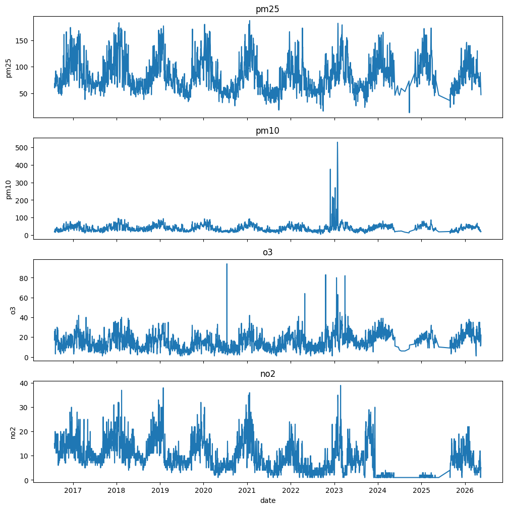
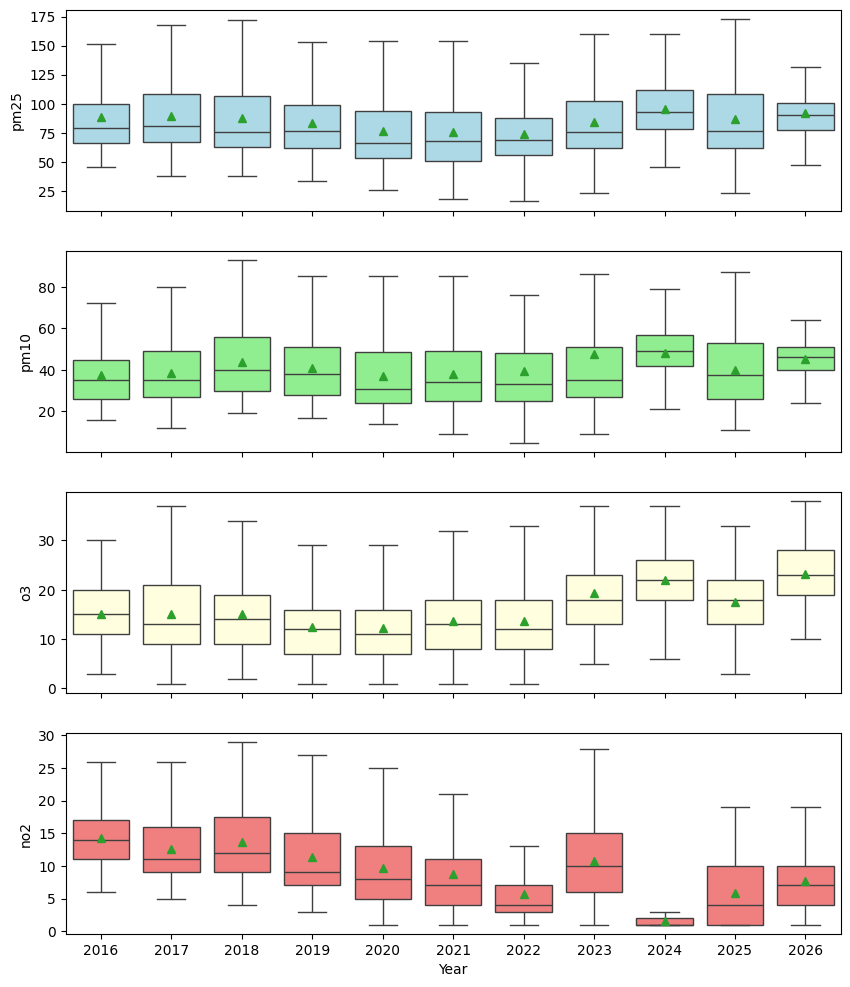
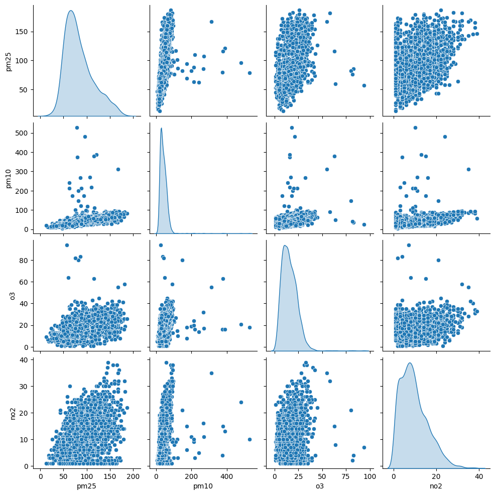
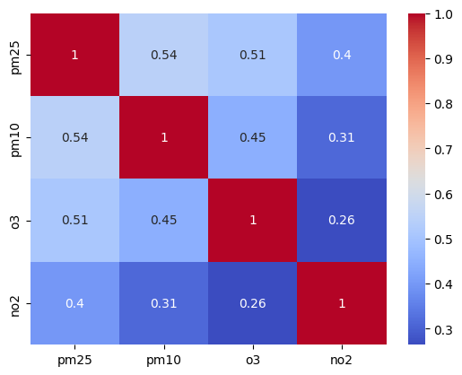
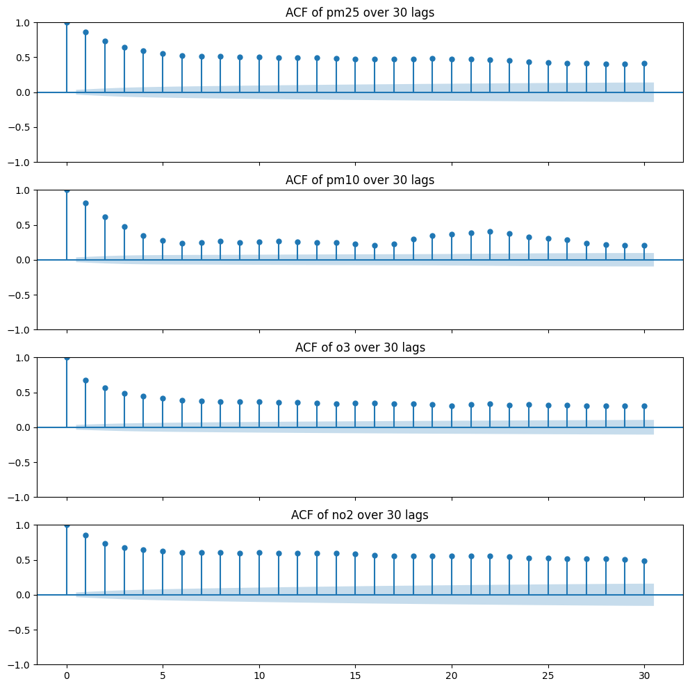
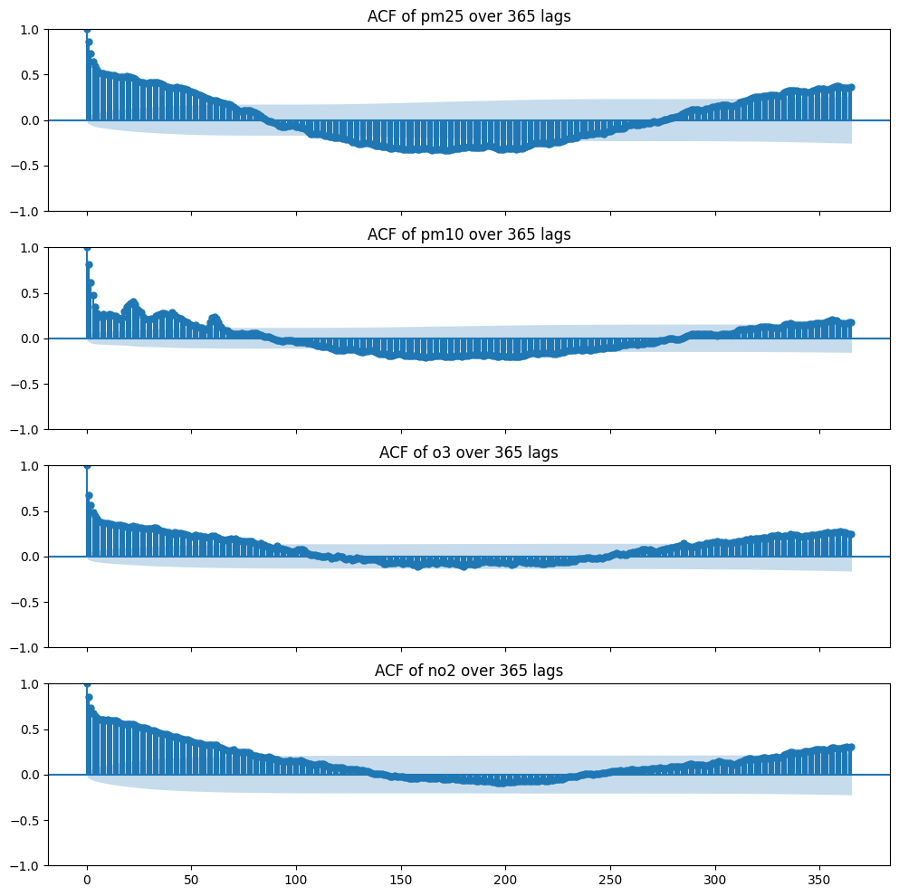
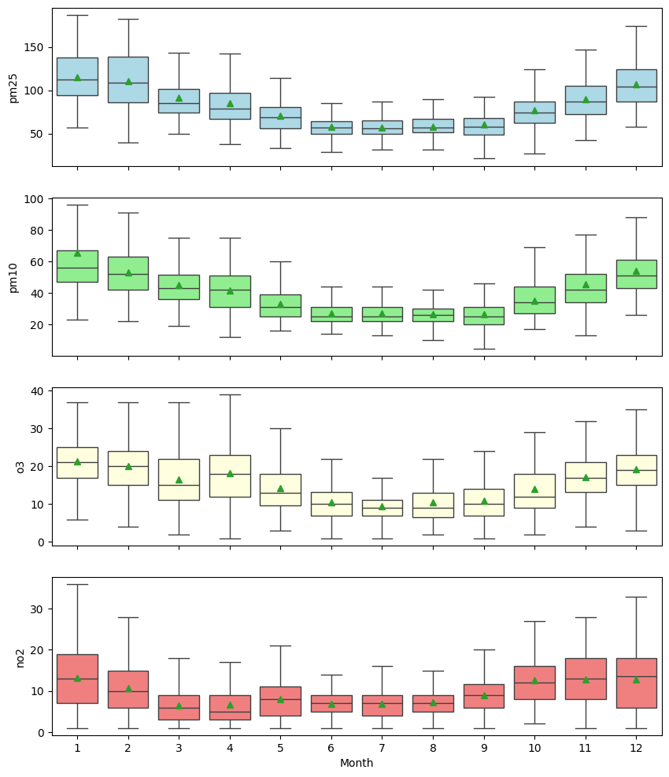
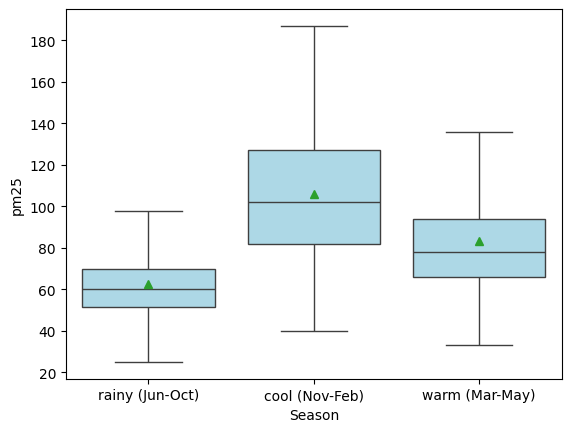
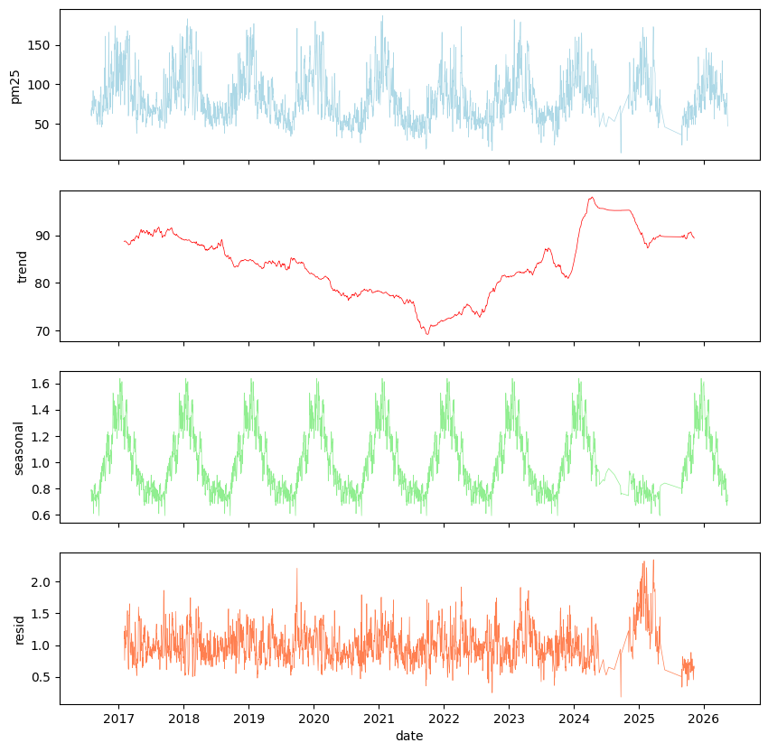

# Bangkok PM2.5 Analysis

## Contents
- [Source](https://aqicn.org/city/bangkok/en/)
- [Data](#Data)
- [Correlation analysis](#Correlation-analysis)
- [Autocorrelation](#Autocorrelation)
- [Monthly and Seasonal distributions](#Monthly-and-Seasonal-distributions)
- [Time Series Decomposition](#Time-Series-Decomposition)
- [Forecasting with ARIMA](#Forecasting-with-ARIMA)
- [Conclusion](#Conclusion)

## Data
The data consist of PM2.5, PM10, O₃, and NO₂ concentrations measured from 2016-01-01 to 2026-05-01. The graphs below show the trends over the 10-year period. From the graph, there are noticeable irregular changes between 2024 and 2025, which may be due to missing data. \
 \
The following figures show boxplots for each pollutant concentration. We can see that PM2.5 concentrations have the narrowest range in 2022 and 2024. The median and mean were also lowest in 2022. \
 \
The pairplots below illustrate the relationships among the pollutants. From the graphs, it can be observed that all pollutants are positively correlated with one another. \

## Correlation analysis
As the results of correlation analysis, PM2.5 concentration correlates with PM10, O₃ and NO₂ concentrations positively with correlation coeffecients of 0.54, 0.51 and 0.4 respectively. No pollutants exhibit negative correlation with another. The correlation matrix is shown in the figure below. \

## Autocorrelation
The figure illustrates the autocorrelation of each pollutant over 30 lags. The ACF of PM2.5 gradually decreases and becomes plateau-like, whereas that of PM10 shows a concave-up pattern between the 15th and 25th lags. Other pollutants also show similar ACF suggesting they are not stationary over a month period. \
 \
Examining the autocorrelation across 365 lags reveals an annual cycle with in the data. The autocorrelations turn negative around the 80th lag and become positive again before the 300th lag. The ACF graphs of other pollutants also show similar patterns differing in magnitudes. In comparison to PM2.5, PM10 exhibits more frequent but subtler fluctuations in positive autocorrelation values. This may correspond to the fluctuation observed the ACF graph over 30 lags. \
 

## Monthly and Seasonal distributions
To inspect monthly and seasonal trends, I have grouped PM2.5 data by month, quarter, and season. Note that there are only 3 seasons in Thailand. For easier grouping, the cool season spans from Nov to Feb, the hot season from Mar to May and the rainy season from Jun to Oct. The definition here may not reflect the actual seasonal variations when the data were observed. \
The boxplots of pollutant levels are shown in the figure below. When grouped by month, both the median and mean PM2.5 concentrations gradually decline from January to June, then rise again from July to December. It is also noticeable that the whiskers become shorter toward the middle of the year, which is in rainy season. \
 \
Grouping by season, we can observe that the median and mean of PM2.5 level are lowest in the rainy season. Furthermore, the interquartile range is narrowest in the rainy season indicating that measured data are tightly clustered. PM2.5 in the cool season shows the greatest variation as it has the largest data range and also the largest interquantile range. Be aware that outliers are not shown in these plots.\
 

## Forecasting with ARIMA
?

## Time Series Decomposition
I have decomposed changes in PM2.5 concentration levels using a multiplicative model with a yearly window size. Time series decomposition yields consistent results where the trend declines between 2016 and 2021 before it rises again around 2022 and reaches the peak in 2024. Irregular patterns are seen in seasonal and residual components between mid-2024 and mid-2025. This may correspond to missing data or unobserved factors. \

## Conclusion
?
